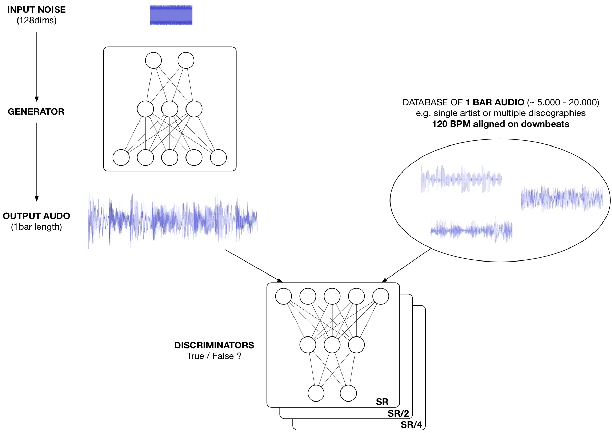
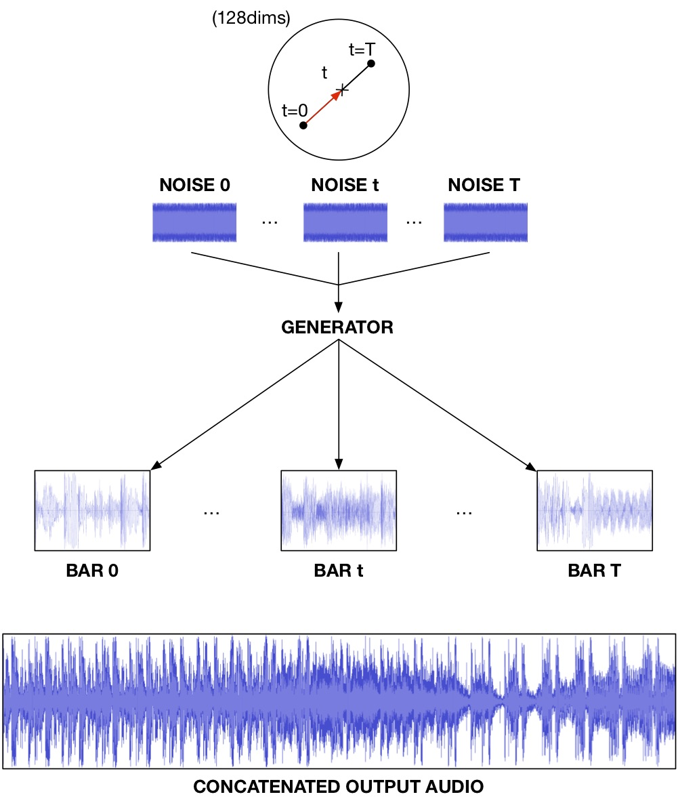

# BERGAN

experiment to make techno music with GANs, default is to train on 2 sec. audio clips at 16kHz = 1 bar 4/4 at 120BPM

unconditional generator and multi-scale discriminators, default working config = WGANGP_2scales_WN_WN_crop0.gin

without GP the GANs are very prone to mode collapse/overfitting, also avoid BN discriminator with GP

minimal requirements, can be installed with pip in a python3 virtualenv (pip install -r requirements.txt)

these requirements do not cover the data preparation pipelines described at the bottom of the readme

## TODO

try training at 32kHz

try other music genres with 4/4 musical structure

train as a VAE/GAN or WAE/GAN to avoid mode collapse of GAN and use deep feature reconstruction in discriminator activations

make a google colab demo (with pretrained models to run in __export_interp.py)

## AUDIO SAMPLES

examples of random linear interpolations with 20 points equally spaced in the generator latent space = 20 bars = 40 sec.

training data is between 5.000 and 20.000 examples of bars extracted from recordings of the "Raster Norton" label

https://raster-media.net (I do not own copyrights, this is an independent research experiment)

models were trained for 48 hours on a single V100 GPU (a 12GB GPU is fine too) ; sampling of 40 sec. on Macbook Pro CPU (2015) takes about 3 sec. so the inference speed is reasonable

https://soundcloud.com/adrien-bitton/interpolations

## GAN TRAINING

optimize the generator to sample realistic 1 bar audio of 2 sec. (120BPM) at SR=16kHz (extendable to 32kHz or 48kHz)

  

## VAE/GAN or WAE/GAN TRAINING

to come

## GENERATION

sample series of 1 bar audio along a random linear interpolation and concatenate the generator outputs into a track at fixed BPM with progressive variation of rhythmic and acoustic content

  

## RELATED PAPERS AND REPOSITORIES

MelGAN

https://arxiv.org/abs/1910.06711

https://github.com/seungwonpark/melgan

WaveGAN

https://arxiv.org/abs/1802.04208

https://github.com/mostafaelaraby/wavegan-pytorch

and a nice review of GAN frameworks

https://arxiv.org/abs/1807.04720

## ACKNOWLEDGEMENTS

thanks to Philippe Esling (https://github.com/acids-ircam) and Thomas Haferlach (https://github.com/voodoohop) for their help in developping the data preparation pipelines

data preparation aims at extracting music bars aligned on the downbeat and stretching them to the target BPM

we either rely on python packages (e.g. librosa, madmom) or on parsing warp markers from Ableton .asd files (https://github.com/voodoohop/extract-warpmarkers)

thanks as well to Antoine Caillon (https://github.com/caillonantoine) for insightful discussion on the challenges of training GANs

and thanks to IRCAM and Compute Canada for the allowed computation ressources for training models
